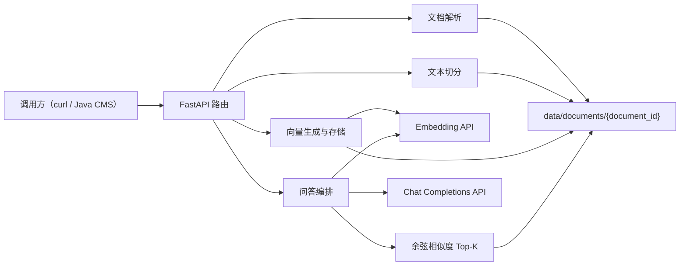
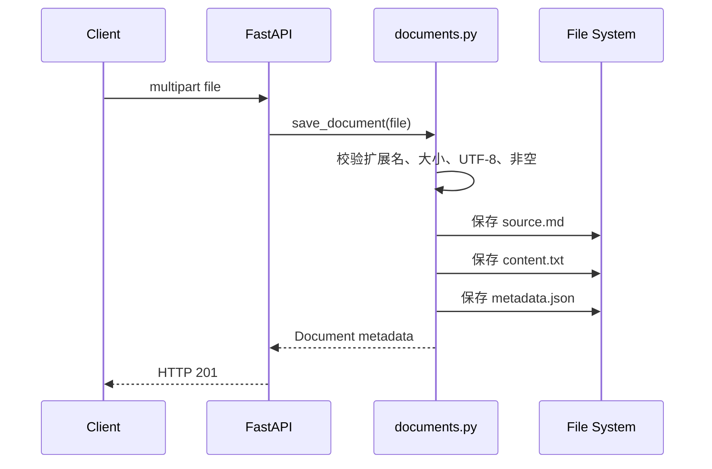
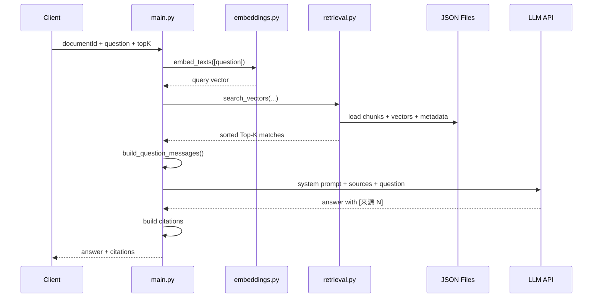
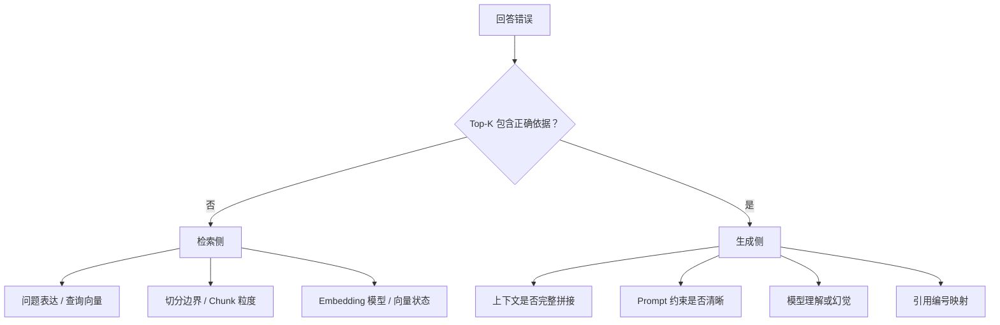

# RAG-CMS 实现解读｜Java / Spring 开发者视角

## 1. 先用一句话理解项目

RAG-CMS 是一个单文档知识问答服务：先把上传文档切成多个带来源位置的文本片段，为每个片段生成向量；提问时把问题也变成向量，找出语义最相似的片段，再把这些片段交给大模型组织答案，并返回可回溯的引用。

它可以理解为下面这条流水线：

```text
离线准备：文档 → 标准文本 → Chunk → Embedding → 本地向量文件
在线问答：问题 → Embedding → Top-K 检索 → 上下文 → LLM → 答案 + 引用
```

这里的“离线”不是一定要异步执行，而是指文档只需预处理一次；“在线”表示每次用户提问都会执行。

## 2. 从 Spring 分层看项目结构

| Python 文件 | 当前职责 | Java / Spring 中的近似角色 |
|---|---|---|
| `app/main.py` | 路由、请求 DTO、流程编排、LLM 调用 | `@RestController` + Application Service + LLM Client |
| `app/documents.py` | 文档校验、解析和保存 | `DocumentService` + `DocumentRepository` |
| `app/chunks.py` | 文本切分、Chunk 元数据生成 | `ChunkingService` |
| `app/embeddings.py` | 调用 Embedding HTTP API | `EmbeddingClient` |
| `app/vectors.py` | Chunk 加载、向量生成与保存 | `VectorService` + `VectorRepository` |
| `app/retrieval.py` | 余弦相似度、Top-K 排序 | `RetrievalService` |
| `tests/test_questions.py` | 隔离外部服务的问答流程测试 | JUnit + Mockito 单元测试 |

这个对照只帮助快速定位，不能完全等同。当前 Python 版本为了保持最小实现，没有严格拆成 Controller、Service、Repository、Client 等包；`main.py` 同时承担了一部分控制层和应用服务职责。

## 3. 整体架构



当前没有数据库和真正的向量数据库。每个文档对应一个目录，JSON 文件承担了学习版 Repository 的职责。

## 4. 五个核心领域对象

虽然代码没有显式定义 Java Entity，但实际存在以下领域对象。

### 4.1 Document

表示一次上传的原始文档，核心字段包括：

```json
{
  "document_id": "UUID",
  "original_filename": "guide.md",
  "byte_size": 1621,
  "character_count": 633,
  "source_path": "UUID/source.md",
  "text_path": "UUID/content.txt"
}
```

Java 中可以定义为 `DocumentMetadata` record 或实体。

### 4.2 Chunk

表示一个可检索文本片段：

```json
{
  "document_id": "UUID",
  "chunk_index": 0,
  "content": "片段正文",
  "source_path": "UUID/source.md",
  "start_offset": 0,
  "end_offset": 225
}
```

`start_offset` 包含，`end_offset` 不包含，等价于 Java 的 `text.substring(startOffset, endOffset)`。这两个位置使引用能够重新定位到标准化后的 `content.txt`。

### 4.3 Embedding Vector

向量是 `List<Double>` 的概念，例如：

```text
[0.012, -0.031, 0.008, ...]
```

真实验收使用 `text-embedding-v4`，每个 Chunk 得到 1024 维向量。向量不是摘要，也不是关键词；它是模型为文本生成的语义空间坐标。

### 4.4 Retrieval Match

检索结果由 Chunk 和相似度分数组成：

```json
{
  "chunk_index": 2,
  "content": "回滚时先停止新流量……",
  "score": 0.712,
  "start_offset": 370,
  "end_offset": 576
}
```

`score` 用于同一次检索中的相对排序，不能直接理解成“答案正确概率为 71.2%”。

### 4.5 Citation

引用是返回给业务调用方的稳定映射：

```json
{
  "reference": 1,
  "document_id": "UUID",
  "chunk_index": 2,
  "source_path": "UUID/source.md",
  "start_offset": 370,
  "end_offset": 576,
  "score": 0.712
}
```

其中 `reference=1` 对应模型上下文里的 `[来源 1]`。业务前端可以据此展示原文，而不是只相信模型生成的引用文字。

## 5. 文档上传是如何实现的

入口是 `POST /v1/documents`，路由位于 `app/main.py`，实际处理委托给 `documents.save_document()`。



关键实现思想：

1. `ALLOWED_SUFFIXES` 只允许 `.md`、`.markdown`、`.txt`。
2. 最多读取 `5 MiB + 1 byte`。多读一个字节是为了判断是否超限，而不是把任意大文件全部读入内存。
3. 原始字节保存为 `source.*`，解析后的统一文本保存为 `content.txt`。
4. 使用 UUID 作为 `document_id`，同时作为目录名。

对应 Spring 写法大致是：

```java
@PostMapping(value = "/v1/documents", consumes = MediaType.MULTIPART_FORM_DATA_VALUE)
public ResponseEntity<DocumentMetadata> upload(@RequestPart MultipartFile file) {
    return ResponseEntity.status(HttpStatus.CREATED)
        .body(documentService.save(file));
}
```

区别是 Spring 通常还会把元数据写入数据库，把文件写入对象存储；当前项目全部写入本地目录。

## 6. 文本切分是如何实现的

入口是：

```http
POST /v1/documents/{document_id}/chunks?chunk_size=800&chunk_overlap=120
```

`split_text()` 使用字符窗口：

1. 从 `start` 开始，暂定 `end = start + chunk_size`。
2. 如果不是最后一段，在窗口后半部分寻找最后一个换行或空格。
3. 找到边界就提前结束，减少在自然边界中间截断。
4. 保存正文和字符偏移。
5. 下一段从 `end - chunk_overlap` 开始，使相邻片段有重叠。

例如：

```text
chunk_size = 10
chunk_overlap = 3

Chunk 0: 字符 0  到 10
Chunk 1: 字符 7  到 17
Chunk 2: 字符 14 到 24
```

重叠是为了避免完整语义刚好跨越边界。但它不是越大越好：重叠过大会增加向量调用、存储、重复召回和模型上下文 Token。

Java 中可以把核心算法设计成无状态 Bean：

```java
public interface ChunkingStrategy {
    List<Chunk> split(String documentId, String text, ChunkingOptions options);
}
```

当前算法的已知局限：

- 按字符而不是 Token 计数；
- 仅识别换行和空格，不理解 Markdown 标题、段落或中文句号；
- 重叠可能让 Chunk 从单词中间开始；
- 文档重新切分会直接覆盖旧 `chunks.json`，但不会自动清理已过期的 `vectors.json`。

最后一点在生产系统中很重要：切分结果变化后，旧向量应该失效或重新生成。

## 7. Embedding 是如何实现的

`embeddings.py` 是一个手写 HTTP Client，而不是 AI 框架。

请求发送到：

```http
POST {LLM_BASE_URL}/embeddings
Authorization: Bearer {LLM_API_KEY}
Content-Type: application/json
```

请求体：

```json
{
  "model": "text-embedding-v4",
  "input": ["Chunk 1", "Chunk 2"]
}
```

代码会验证：

- 返回体必须是 JSON 对象；
- `data` 数量必须等于输入文本数量；
- 按上游返回的 `index` 恢复顺序；
- 每个向量非空且全部是数值；
- 同一批结果维度一致。

这对应 Java 中使用 `WebClient` 编写的 `EmbeddingClient`。实际工程中还应补充连接池、重试、超时分类、限流、指标、Trace ID 和密钥托管。

当前代码把 `BATCH_SIZE` 固定为 100，但具体上游模型可能允许更小的单批输入数量。真实使用百炼 `text-embedding-v4` 时应以平台限制为准，后续适合把批大小改成配置项；首周真实验收只有 4 至 5 个 Chunk，因此没有触发该边界。

`vectors.create_embeddings()` 负责应用层编排：读取 Chunk 正文 → 调用 Embedding → 保存向量。这相当于 Java 中的 `VectorizationService.vectorize(documentId)`。

## 8. 向量为什么能够检索语义

文档 Chunk 和用户问题使用同一个 Embedding 模型后，会落在同一个向量空间。语义越接近，向量方向通常越接近。

项目使用余弦相似度：

```text
cos(A, B) = (A · B) / (|A| × |B|)
```

代码分别计算：

1. 两个向量的长度必须相同；
2. 计算左右向量的模；
3. 拒绝零向量；
4. 计算点积并除以两个模；
5. 对所有 Chunk 按分数倒序；
6. 截取前 `top_k` 个。

当前复杂度近似为：

```text
O(Chunk 数量 × 向量维度)
```

因为每次提问都要把查询向量和该文档的所有向量逐个比较。小文档足够直观，但大规模时应由向量数据库的索引执行近似最近邻检索。

## 9. 为什么必须使用同一个 Embedding 模型

`retrieval.search_vectors()` 会检查文档向量记录的模型是否等于本次查询使用的模型。

原因不是接口约定，而是数学空间约束：不同 Embedding 模型学习出的坐标系、维度和含义可能完全不同。即使恰好都是 1024 维，也不能认为第 100 个维度表达同一种特征。

Java 类比：这不像两个实现相同接口的普通 Service 可以互换，更接近“使用不同序列化协议生成的字节不能直接比较”。更换模型后，需要重新向量化文档。

## 10. 一次问答请求的完整调用链

入口：

```http
POST /v1/documents/{document_id}/questions
```

请求体：

```json
{
  "question": "数据库变更发布失败后如何回滚？",
  "top_k": 3
}
```

完整链路：



逐步对应代码：

1. Pydantic 校验问题长度和 `top_k` 范围。
2. `strip()` 后再次拒绝纯空白问题。
3. `embed_texts([question])` 生成查询向量。
4. `search_vectors()` 在指定 `document_id` 内检索。
5. `build_question_messages()` 把 Top-K Chunk 编号为 `[来源 1]`、`[来源 2]`。
6. System Prompt 要求只能依据上下文回答，无法确定时明确说明。
7. `invoke_model()` 调用 `/chat/completions`。
8. `answer_text()` 从 `choices[0].message.content` 提取回答。
9. 服务端根据 Top-K 顺序自行构造 `citations`，不让模型伪造路径和偏移。

## 11. 为什么当前问答必须携带 document_id

当前存储布局以 `document_id` 为目录边界：

```text
data/documents/{document_id}/chunks.json
data/documents/{document_id}/vectors.json
```

因此检索必须先知道在哪个目录中搜索。这是单文档问答设计，不是 RAG 的强制要求。

生产演进通常是：

```text
document_id
→ collection_id / knowledge_base_id
→ collection + metadata filter
→ tenant + user permission + document status filter
```

对应 Java CMS，最终用户通常只选择知识库或业务空间，后端根据权限拼装过滤条件，不让用户手工处理文档 UUID。

## 12. 上下文拼接与 Prompt 的作用

Top-K 检索返回的仍然只是文本片段，不能直接成为答案。`build_question_messages()` 将它们组织成：

```text
[来源 1] 文件：...；片段：2
片段正文

[来源 2] 文件：...；片段：0
片段正文

问题：……
```

System Prompt 负责规定行为：

- 只能依据给定上下文；
- 不确定时明确说明；
- 用 `[来源 N]` 标注事实。

这类似 Java 应用服务把 Repository 查询结果转换成下游 RPC DTO，但 Prompt 不是强类型协议。模型仍可能遗漏、误解或违反要求，所以必须保留服务端引用映射和评测。

## 13. asyncio.to_thread 为什么存在

问答路由是 `async def`，但项目使用的 `urllib.request.urlopen()` 是阻塞 I/O。如果直接调用，它会阻塞 FastAPI 的事件循环，影响其他请求。

代码使用：

```python
await asyncio.to_thread(blocking_function, ...)
```

把阻塞调用移到线程中执行。

Java 类比：类似在 WebFlux 中不能直接在 Event Loop 执行阻塞 JDBC，而需要切换到适合阻塞工作的线程池。不同点是当前项目只做了最小线程卸载，没有显式线程池隔离、容量限制和背压策略。

## 14. 本地文件如何承担 Repository 职责

每个文档目录最终可能包含：

```text
data/documents/{document_id}/
├── source.md       # 原始文件
├── content.txt     # 统一文本
├── metadata.json   # 文档、切分和向量元数据
├── chunks.json     # Chunk 正文及位置
└── vectors.json    # Chunk 向量
```

`metadata.json` 会随着处理阶段逐步增加：

```text
上传完成：document metadata
切分完成：+ chunking
向量完成：+ vector_store
```

这是一种简单的状态机，但没有事务。如果写 `vectors.json` 成功而更新 `metadata.json` 失败，就可能出现不一致。生产 Java 实现应考虑数据库事务、对象存储一致性、处理状态和幂等重试。

## 15. HTTP 状态码表达了什么

| 状态码 | 当前含义 | Java 常见处理 |
|---|---|---|
| `201` | 文档创建成功 | `ResponseEntity.status(CREATED)` |
| `404` | 文档 ID 非法或文档不存在 | `DocumentNotFoundException` |
| `409` | 前置状态不满足，如未切分、未向量化、模型不一致 | 领域状态冲突 |
| `413` | 上传文件过大 | Multipart 限制异常 |
| `415` | 文件类型不支持 | Unsupported Media Type |
| `422` | 参数或内容有效性错误 | Bean Validation / Domain Validation |
| `502` | 上游模型失败或返回格式异常 | 下游依赖失败 |
| `503` | 模型配置缺失 | 服务依赖未配置或暂不可用 |

当前直接在业务模块抛 `HTTPException`，实现简单但把领域逻辑绑定到 FastAPI。Java 分层时更建议抛领域异常，再由 `@RestControllerAdvice` 统一转换状态码。

## 16. 测试代码验证了什么

`tests/test_questions.py` 使用 `unittest.mock.patch` 替换：

- `embed_texts()`；
- `search_vectors()`；
- `invoke_model()`。

因此测试不调用真实模型，重点验证问答编排：

1. 查询向量是否传给检索；
2. `document_id`、模型和 `top_k` 是否正确传递；
3. Top-K 内容是否进入 Prompt；
4. 回答是否正确提取；
5. 引用是否保留 Chunk 信息；
6. 纯空白问题是否返回 422。

对应 JUnit / Mockito 思路：

```java
when(embeddingClient.embed(anyList())).thenReturn(queryVector);
when(retrievalService.search(...)).thenReturn(matches);
when(llmClient.chat(...)).thenReturn(modelAnswer);

QuestionResponse result = questionService.ask(...);

verify(retrievalService).search(documentId, model, queryVector, topK);
assertThat(result.citations()).hasSize(1);
```

单元测试不能代替真实模型验收。项目还使用固定语料和 10 个问题做端到端评测，两者分别解决“代码编排是否正确”和“RAG 效果是否可用”。

## 17. 三类错误应该怎样定位

不要每次都从文件上传重新排查。先查看 Top-K 是否包含正确依据：



三个典型问题：

1. **检索错误**：正确 Chunk 没进入 Top-K。
2. **生成错误**：正确 Chunk 已进入上下文，但回答仍错误。
3. **引用错误**：回答内容正确，但 `[来源 N]` 或返回的 citation 不支持该结论。

## 18. Top-K 实验说明了什么

真实评测中的跨段回滚问题得到：

- `top_k=1`：只召回局部片段，模型无法获得完整回滚步骤；
- `top_k=3`：召回多个相关片段，答案覆盖停止流量、恢复旧版本、回滚 SQL、健康检查和事故初报。

正确理解是：一个答案的证据分布在多个 Chunk，不是存在三个不同答案。

增大 Top-K 的收益和代价：

| 变化 | 可能收益 | 可能代价 |
|---|---|---|
| Top-K 增大 | 提高跨段、多事实问题的召回 | 更多无关内容、Token、延迟和干扰 |
| Top-K 减小 | 上下文更集中、成本更低 | 可能遗漏关键证据 |

因此 Top-K 需要评测，而不是凭经验固定。

## 19. 当前实现做对了什么

- 原始文件、标准文本、Chunk、向量和元数据分开保存；
- Chunk 保留文档、序号、来源和字符偏移；
- 记录 Embedding 模型、向量数量和维度；
- 查询模型必须与文档向量模型一致；
- 对外部模型响应做基本结构校验；
- 引用元数据由服务端构造，不完全相信模型；
- 未配置模型时明确返回 503；
- 有隔离外部依赖的单元测试和真实端到端评测。

这些都是以后 Java 化时应该保留的行为约束。

## 20. 当前实现还不是生产系统的原因

- 只支持单文档检索；
- 本地 JSON 全量扫描，没有向量索引；
- 无用户、租户和文档权限；
- 无数据库事务、幂等状态和并发控制；
- 重新切分后的旧向量失效机制不完整；
- 模型调用没有重试、退避、限流和熔断；
- Prompt 尚未防御文档内的指令注入；
- 没有问答日志、Token、延迟和模型用量指标；
- 测试只覆盖问答编排的部分路径；
- 10 题评测集尚未全部形成完整基线。

这些不是当前实现“失败”，而是首周主动控制的范围。

## 21. 如果用 Spring Boot 重构，建议怎样分层

```text
com.example.ragcms
├── api
│   ├── DocumentController
│   ├── QuestionController
│   └── dto
├── application
│   ├── DocumentApplicationService
│   ├── VectorizationService
│   └── QuestionAnswerService
├── domain
│   ├── Document
│   ├── Chunk
│   ├── Citation
│   ├── RetrievalMatch
│   └── ChunkingStrategy
├── infrastructure
│   ├── embedding/EmbeddingClient
│   ├── llm/LlmClient
│   ├── persistence/DocumentRepository
│   └── vector/VectorRepository
└── support
    ├── exception
    └── configuration
```

推荐先让 Java 作为调用方，而不是立即重写 Python：

```text
Spring Boot CMS
→ 调用 Python RAG-CMS API
→ 验证超时、重试、日志和引用展示
```

这样能先学习真实的跨服务集成。等接口和领域边界稳定后，再决定哪些模块值得迁移到 Java。

## 22. 阅读代码的推荐顺序

不要从 `main.py` 第一行一路读到底。按一次业务请求阅读：

### 第一遍：文档进入系统

1. `main.upload_document()`
2. `documents.save_document()`
3. 查看生成的 `metadata.json` 和 `content.txt`

### 第二遍：文档变成可检索数据

1. `main.chunk_document()`
2. `chunks.split_text()`
3. `vectors.create_embeddings()`
4. `embeddings.embed_texts()`
5. 查看 `chunks.json` 和 `vectors.json`

### 第三遍：问题变成答案

1. `main.ask_document()`
2. `embeddings.embed_texts([question])`
3. `retrieval.search_vectors()`
4. `main.build_question_messages()`
5. `main.invoke_model()`
6. 检查最终 `answer` 和 `citations`

### 第四遍：失败路径

依次尝试无效文档 ID、未切分先向量化、切分后未向量化直接提问、Embedding 模型切换、纯空白问题和不可回答问题。

## 23. 建议亲自完成的五个练习

1. 手算两个二维向量的余弦相似度，再对照 `cosine_similarity()`。
2. 使用同一文本比较三组 `chunk_size / overlap`，观察切分边界。
3. 对跨段问题比较 `top_k=1` 和 `top_k=3`，先看 Chunk 再看答案。
4. 修改一个文档事实并重新上传，确认旧文档 ID 的结果不会自动变化。
5. 用 Spring Boot `WebClient` 调用 `/questions`，把 citations 映射成 Java DTO。

完成这五个练习后，你掌握的就不只是 Python 语法，而是可以迁移到 Java、其他向量数据库和其他模型平台的 RAG 核心设计。

## 24. 最终心智模型

RAG 不是“把文档发给大模型”。它是两个相互衔接、但可以分别失败的系统：

```text
检索系统：问题 → 正确证据
生成系统：正确证据 → 忠实答案
```

引用系统再为两者提供可验证性：

```text
答案中的 [来源 N]
→ 服务端 citation
→ document_id + chunk_index
→ source_path + start/end offset
→ 原文
```

对长期 Java 开发者而言，最值得迁移的理解是：模型只是一个不完全确定的外部依赖。可靠系统仍然需要清晰的数据契约、状态校验、错误分层、可追溯性、可重复测试和业务权限边界。
