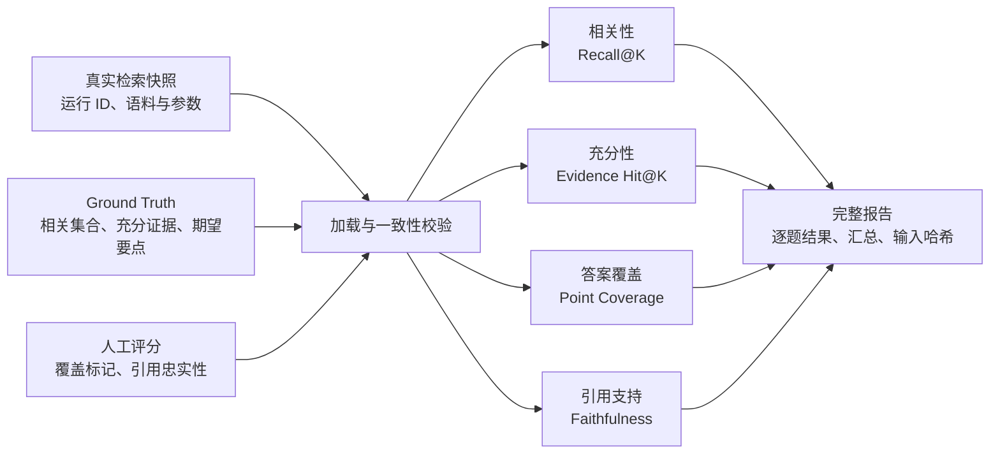

# RAG 四层评测体系｜从单一 Recall 到可追溯评测制品

## 业务背景

RAG-CMS 需要回答 CMS 发布规范问题，并让每个回答可以追溯到原文。十题基线已经能计算 Recall@K，但重叠 Chunk、回答遗漏和无依据主张无法由一个 Recall 指标解释。

当前固定语料切为 4 个 Chunk，评测集包含 10 题，检索对照使用 K=1、3。目标不是追求一个更高总分，而是把失败定位到标注、检索、生成或引用层。

## 原有问题

1. 把所有相关 Chunk 当作唯一 Ground Truth，重叠文本会让 Recall 低估可回答性；
2. 检索到证据不代表回答覆盖全部要点；
3. 回答覆盖全部要点也可能附加无依据主张；
4. 历史检索顺序只在 Markdown 表格中，模型、语料、参数和输入版本容易错配。

## 核心约束

- 评测必须离线可复核，不能依赖每次都调用外部服务；
- 人工自然语言判断必须明确标记，不能伪装成自动客观指标；
- 固定十题、语料、Chunk 参数和模型，不在建立基线时同时调参；
- 外部服务只有在归属和数据处理授权明确时才能接收问题；
- Python 3.9 环境下使用简单 JSON 文件，不引入评测平台。

## 解决方案

数据结构分为三类事实：

- `week-02-cases.json`：问题、期望要点、相关 Chunk、充分证据集合；
- `week-03-manual-scores.json`：人工确认的要点覆盖和引用忠实性；
- `week-03-retrieval-snapshot.json`：既有真实检索顺序及语料、用例、Chunk、Embedding 元数据。

CLI 在线模式生成新 Query Embedding；离线模式只重放已保存的真实顺序。两种模式在报告中显式区分，并记录输入 SHA-256。

## 关键取舍

### 取舍 1｜四层指标，而不是单一“正确率”

选择分别报告相关性、充分性、覆盖度和引用支持。代价是报告更复杂，但能回答“失败发生在哪一层”，避免用一个数字掩盖不同根因。

### 取舍 2｜保留所有相关 Chunk，同时增加充分证据集合

不删除重叠但相关的 Chunk，而用充分证据集合表达替代证据。例如第 3 题保留相关集合 `[0,1]`，充分证据为 `[[0],[1]]`。这样既保留检索覆盖信息，也能正确判断上下文是否可回答。

### 取舍 3｜保存真实快照，而不是把旧表格直接写死进测试

快照带运行 ID、来源记录、提交、语料哈希、用例哈希和参数。它比散落在测试代码中的数组更容易审计。代价是快照可能过期，不能冒充新模型或新参数的在线结果。

### 取舍 4｜授权不足时离线复核，而不是强行在线重跑

离线重放保证现有证据可验证，同时清楚声明它不证明当前外部模型行为。安全边界优先于“今天必须得到一次新在线结果”。

## 风险与限制

- 人工评分仍可能存在标注分歧，结构校验不能证明语义判断正确；
- SHA-256 能证明文件是否变化，不能证明数据本身标注正确；
- 保存的 Top-3 只能评估 `K≤3`，无法推导 Top-5；
- 快照绑定旧 Embedding 结果，模型或参数改变后必须重新运行；
- 当前人工评分尚未保存完整原始回答和逐主张引用映射，仍有进一步追溯空间。

## 可迁移经验

1. 企业 AI 评测应把输入、配置、结果和人工判断视为一个版本化制品；
2. 指标要对应故障层次，不能让一个宏平均承担所有解释；
3. 保存原始事实，比例和汇总由纯函数派生；
4. 离线重放适合回归与审计，在线运行适合验证当前模型行为；二者必须明确标记。

## 对 RAG-CMS 的启发

下一步应把同样的可追溯原则用于 Java 调用链：Java 请求 ID、Python 问答响应、引用 DTO、上游错误和耗时需要保留一致的关联标识。首个迁移动作是在 Java 最小客户端中定义稳定的请求/响应 DTO 和错误映射，而不是立即引入完整微服务治理。
